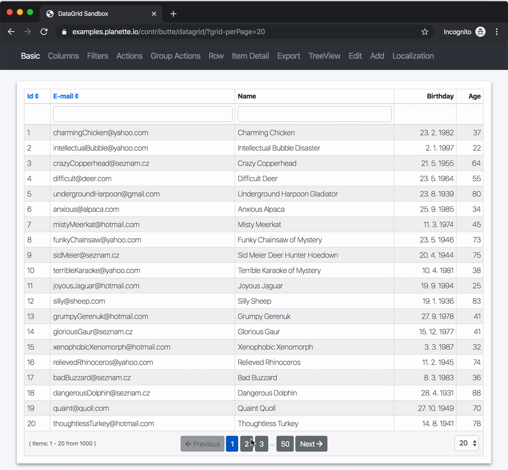

# Datagrid

First class DataGrid for Nette Framework.

Supported features: filtering, sorting, pagination, tree view, table view, translator, etc

> Give us a star, it makes us so happy. Thanks ⭐.️

-----

-----

## Versions

| State       | Version   | Branch   | Nette | PHP      |
|-------------|-----------|----------|-------|----------|
| dev         | `^6.3.0`  | `master` | >=3.0 | `^7.2` |
| stable      | `^6.2.0`  | `master` | >=3.0 | `^7.2` |
| stable      | `^6.1.0`  | `master` | >=3.0 | `^7.2` |
| stable      | `^5.7.1`  | `v5.x`   | >=2.3 | `^5.6` |
| stable      | `^4.4.22` | `v5.x`   | >=2.3 | `^5.6` |
| stable      | `^3.3.1`  | `v5.x`   | >=2.3 | `^5.3` |

## Useful links

| What | Where |
|-|-|
| **Documentation** | [contributte.org/packages/contributte/datagrid/](https://contributte.org/packages/contributte/datagrid/) |
| **Demo** | [examples.contributte.org/packages/datagrid/](https://examples.contributte.org/packages/datagrid/) |
| **Example project** | [github.com/planette/playground/tree/master/contributte-datagrid](https://github.com/planette/playground/tree/master/contributte-datagrid) |
| **Forum (EN)** | will be updated |
| **Forum (CZ)** | [forum.nette.org/cs/25444](https://forum.nette.org/cs/25444-ublaboo-datagrid-mocny-rychly-rozsiritelny-hezky-anglicky-dokumentovany-datagrid) |

## GitHub Issues & Sponsoring

Sometimes, when there is a new issue opened (either with a new feature request or a bug report), we may assign a label with a dollar sign (**$**) and an amount of dollars to the issue. This is an opportunity for you to support datagrid vendor creators and resolve particular issue.

Thank you for your support. ❤

## Maintainers

<table>
	<tbody>
		<tr>
			<td align="center">
				
				 
				<a href="https://github.com/paveljanda">Pavel Janda</a>
			</td>
			<td align="center">
				
				 
				<a href="https://github.com/f3l1x">Milan Felix Šulc</a>
			</td>
		</tr>
	</tbody>
</table>

### Former maintainers

<table>
	<tbody>
		<tr>
			<td align="center">
				
				 
				<a href="https://github.com/juniwalk">Martin Procházka</a>
			</td>
		</tr>
	</tbody>
</table>

-----

Thank you for testing, reporting and contributing.
