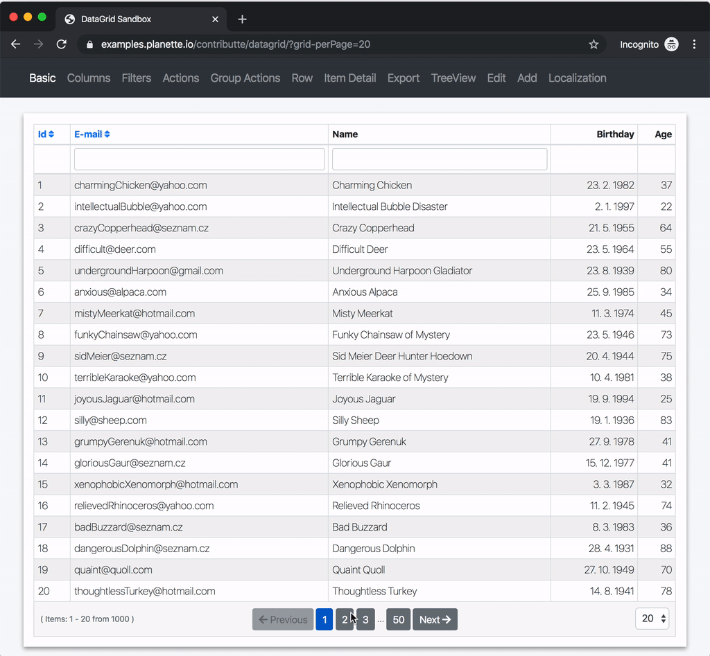

<p align=center>
	<a href="https://github.com/contributte/datagrid/actions"></a>
	<a href="https://codecov.io/gh/contributte/datagrid"></a>
	<a href="https://packagist.org/packages/ublaboo/datagrid"></a>
	<a href="https://packagist.org/packages/ublaboo/datagrid"></a>
</p>
<p align=center>
	<a href="https://packagist.org/packages/contributte/datagrid"></a>
	<a href="https://github.com/contributte/datagrid"></a>
	<a href="https://bit.ly/ctteg"></a>
	<a href="https://bit.ly/cttfo"></a>
	<a href="https://contributte.org/partners.html"></a>
</p>

<p align=center>
Website 🚀 <a href="https://contributte.org">contributte.org</a> | Contact 👨🏻‍💻 <a href="https://paveljanda.com">paveljanda.com</a>, <a href="https://f3l1x.io">f3l1x.io</a> | Twitter 🐦 <a href="https://twitter.com/contributte">@contributte</a>
</p>

<p align=center>
	
</p>

First class datagrid for Nette Framework with filtering, sorting, pagination, tree view, table view, localization, exports and inline editing.

## Versions

| State  | Version   | Branch   | Nette  | PHP     |
|--------|-----------|----------|--------|---------|
| dev    | `^7.2.x`  | `master` | `3.2+` | `>=8.2` |
| stable | `^7.1.0`  | `master` | `3.2+` | `>=8.2` |
| stable | `^7.0.0`  | `master` | `3.2+` | `>=8.1` |
| stable | `^6.10.0` | `master` | `3.0+` | `>=7.2` |

## Installation

To install latest version of `ublaboo/datagrid` use [Composer](https://getcomposer.org).

```
composer require ublaboo/datagrid
```

## Quick start

Create a component, give it an array data source, and add one column:

```php
use Contributte\Datagrid\Datagrid;

protected function createComponentUsersGrid(): Datagrid
{
	$grid = new Datagrid($this, 'usersGrid');
	$grid->setDataSource([
		['id' => 1, 'name' => 'John'],
	]);
	$grid->addColumnText('name', 'Name');

	return $grid;
}
```

Render `{control usersGrid}` in the component template. It renders a grid with a **Name** column and the `John` row. See [the detailed documentation index](.docs/README.md) for data-source variants and all grid modes.

## Resources

| Resource | Link |
|----------|------|
| **Skeleton Demo** | [https://examples.contributte.org/datagrid-skeleton/](https://examples.contributte.org/datagrid-skeleton/) |
| **Skeleton Repository** | [github.com/contributte/datagrid-skeleton](https://github.com/contributte/datagrid-skeleton) |

## Development

See [how to contribute](https://contributte.org) to this package. This package is currently maintained by these authors.

<a href="https://github.com/paveljanda">
	
</a>

<a href="https://github.com/f3l1x">
	
</a>

-----

Consider to [support](https://contributte.org/partners) **contributte** development team.
Also thank you for using this package.
